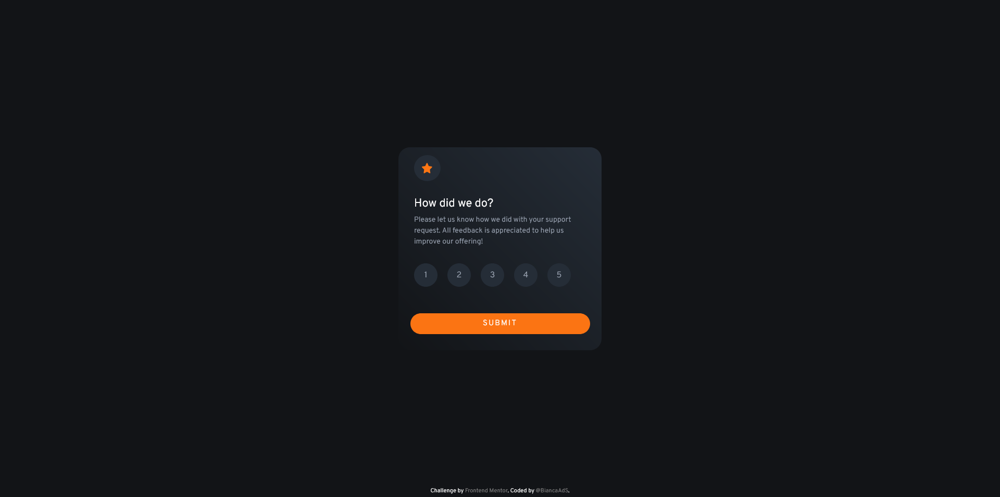
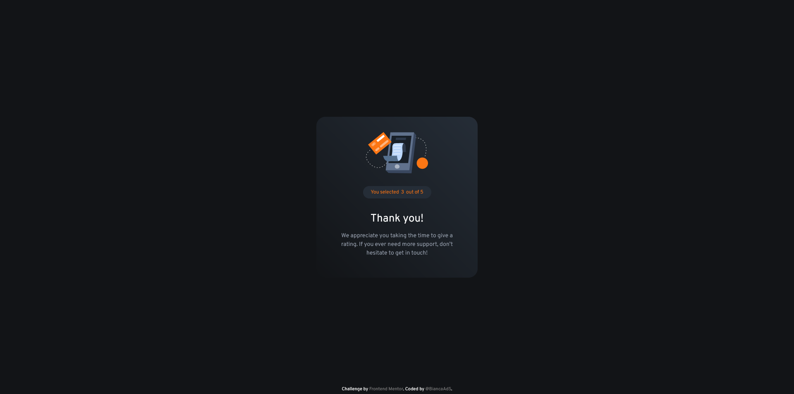
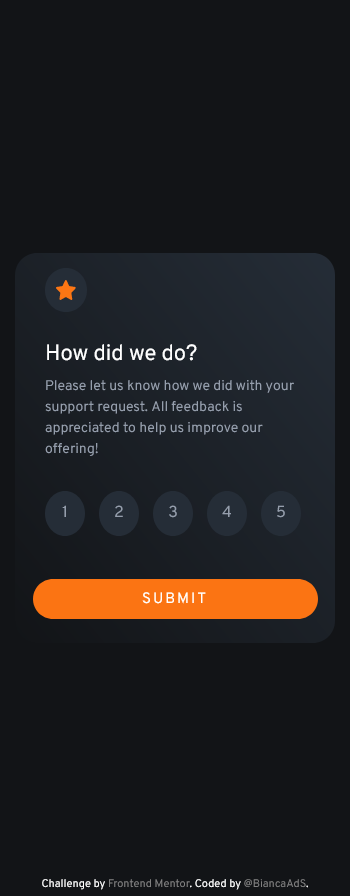
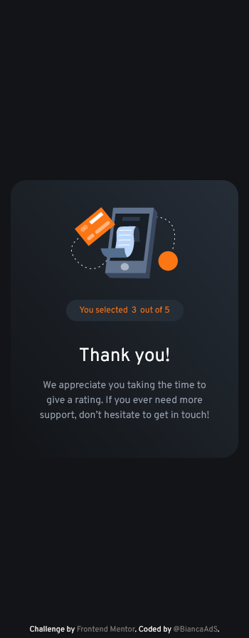

# Frontend Mentor - Interactive rating component solution

This is a solution to the [Interactive rating component challenge on Frontend Mentor](https://www.frontendmentor.io/challenges/interactive-rating-component-koxpeBUmI). Frontend Mentor challenges help you improve your coding skills by building realistic projects. 

## Table of contents
  - [Overview :rocket:](#overview-rocket)
    - [Screenshot](#screenshot)
    - [Links](#links)
  - [My process](#my-process)
    - [Built with](#built-with)
  - [Author](#author)

## Overview :rocket:

### Screenshot :camera:

**For Desktop** :computer:

**For Mobile** :iphone: 

### Links

- Solution URL: [Solution URL](https://github.com/BiancaAdS/interactive-rating-component)
- Live Site URL: [Live Site URL](https://interactive-rating-component-six-rose.vercel.app/)

## My process

### Built with :construction:

- HTML
- CSS
- JS

## Author

- GitHub - [@BiancaAdS](https://github.com/BiancaAdS)
- Frontend Mentor - [@BiancaAdS](https://www.frontendmentor.io/profile/BiancaAdS)
